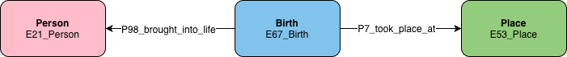
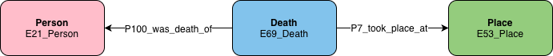

## Graph Patterns

This page lists common graph patterns that we encounter when modelling data in LINCS.

## General Patterns

### Names & Titles

### Type

### Event Date

### Event Location

## Patterns Involving People

### Birth Date

### Birth Place

### Death Date

### Death Place

### Occupation

## Patterns Involving Groups

## Patterns Involving Places

### Other useful commands

