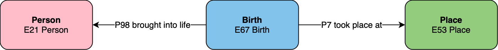
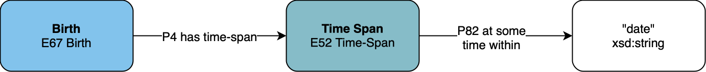
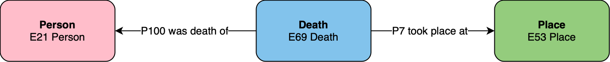
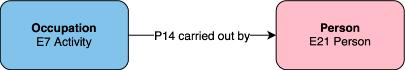
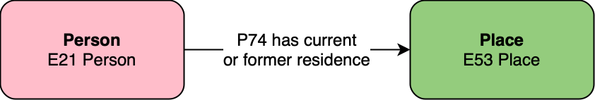
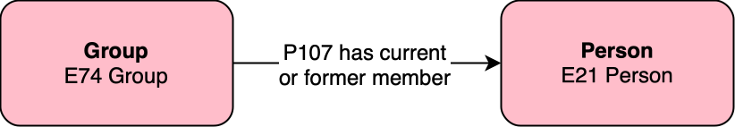

This page lists common graph patterns that we encounter when modelling data in [LINCS](https://lincsproject.ca) using the [CIDOC CRM](https://cidoc-crm.org) ontology. When modelling data, we select appropriate graph patterns and combine them together to create our data model. Then we apply the model to our dataset, resulting in a knowledge graph.

## General Patterns

### Name

An entity has a name (or title).

{fig-align="center" width=60%}

### Type

An entity has a type.

{fig-align="center" width=60%}

## Patterns Involving Events

The following patterns are applicable to any event or its subclasses colored in blue, such as Activity (including occupations), Birth, Death, Production, Move, etc.

### Event Place

An event took place at a certain place.

{fig-align="center" width=60%}

### Event Date

An event took place on a certain date.

## Patterns Involving People

The following patterns are applicable to any person.

### Person Name

A person has a name.

{fig-align="center" width=60%}

### Birth Date

A person was born on a certain date.

### Birth Place

A person was born in a certain place.

### Death Date

A person died on a certain date.

### Death Place

A person died in a certain place.

### Occupation

A person has an occupation such as an employment or appointment.

{fig-align="center" width=60%}

### Residence

A person resides (or has previously resided) in a place.

{fig-align="center" width=60%}

## Patterns Involving Groups

The following patterns are applicable to any group, including companies and other organizations.

### Group Name

A group has a name.

{fig-align="center" width=60%}

### Formation

A group has a member (a person).

{fig-align="center" width=60%}

### Dissolution

A group has a member (a person).

{fig-align="center" width=60%}

### Membership

A group has a member (a person).

{fig-align="center" width=60%}

### Joining

### Leaving

## Patterns Involving Places

The following patterns are applicable to any place.

### Place Name

A place has a name.

{fig-align="center" width=60%}

### Place Containment

A place contains another place.

{fig-align="center" width=60%}

